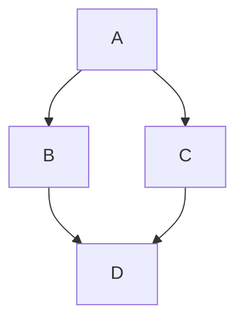

## 单页链接测试
[test](test.md)

## 常用链接

* [GitHub Markdown 格式](https://github.github.com/gfm/) 
* [mermaid 文档](https://mermaid-js.github.io/mermaid/#/)

## mermaid 流程图测试

## markdown 格式测试

### 单体应用改造：

1. 有状态服务改为无状态服务：使用 jwt bearer 认证
1. 本地配置文件改为配置中心：使用 nacos 等
1. 本地日志改为日志中心：使用 elk 等

### 服务间调用改造

1. 从配置中读取服务中心地址
1. 从服务中心读取API地址列表并实时接收API列表的更新

### 前后端分离改造

1. 前端单独部署
1. 通过网关统一访问后端API