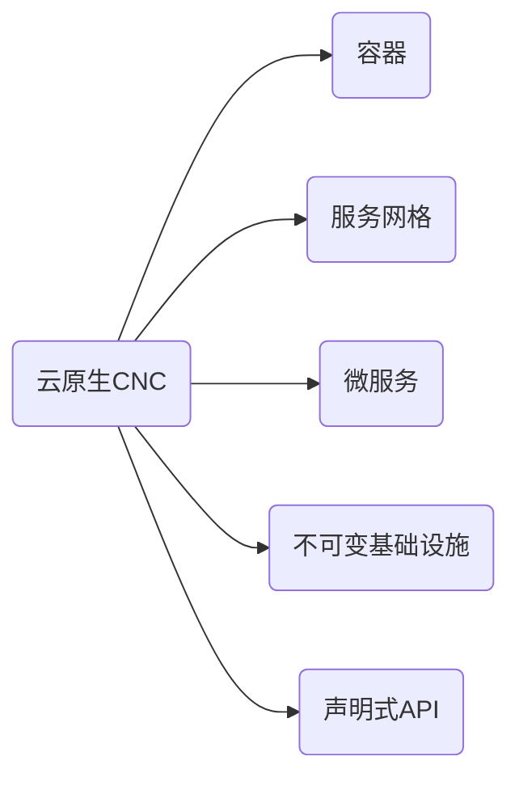

# nbaxp.github.io

## 目录

1. [markdown](markdown.md)
1. [git](git.md)
1. [测试](test.md)

## 待办

-   [x] github.io
    -   [x] 动态加载 markdown 文件，默认加载 README.md
    -   [x] [jsdelivr](https://www.jsdelivr.com/)
    -   [x] [marked](https://marked.js.org/)(commonmark 不支持复选框)
    -   [x] [MathJax](https://github.com/mathjax/MathJax)，写在行内代码或代码块内避免 markdown 解析冲突
    -   [x] [mermaid](https://github.com/mermaid-js/mermaid)
    -   [x] [flowchart.js](https://github.com/adrai/flowchart.js)
    -   [x] [js-sequence-diagrams](https://github.com/bramp/js-sequence-diagrams)
-   [x] markdown
-   [ ] docker
    -   [x] [brpc media server](https://github.com/nbaxp/brpc-media-server)
    -   [x] [srs](docker/srs/README.md)
    -   [x] [srs arm64 build](docker/srs-arm64-qemu-build/git/srs/README.md)
-   [ ] git
    -   [ ] git 基础
    -   [ ] git 分支
    -   [ ] git flow

## 目录

1. <https://github.com/cncf/toc/blob/main/DEFINITION.md>
2. <https://raw.githubusercontent.com/cncf/trailmap/master/CNCF_TrailMap_latest.png>

## 常用链接

### 综合

1. <https://www.infoq.cn/>
1. <https://devblogs.microsoft.com/dotnet/>
1. <https://www.oschina.net/>
1. <https://www.cnblogs.com/>
1. <https://www.51cto.com/>

### 常用

1.  <https://stackoverflow.com/>
1.  <https://github.com/>

### 程序包

1. <https://hub.docker.com/>
1. <https://www.npmjs.com/>
1. <https://nuget.org/>
1. <https://mvnrepository.com/>

### 教程

1. <https://www.runoob.com/>
1. <https://www.ityuan.com/>

### 工具
1. <https://shields.io/>

### 文档
1. <https://docs.microsoft.com/zh-cn/>
1. <https://www.cncf.io/>
