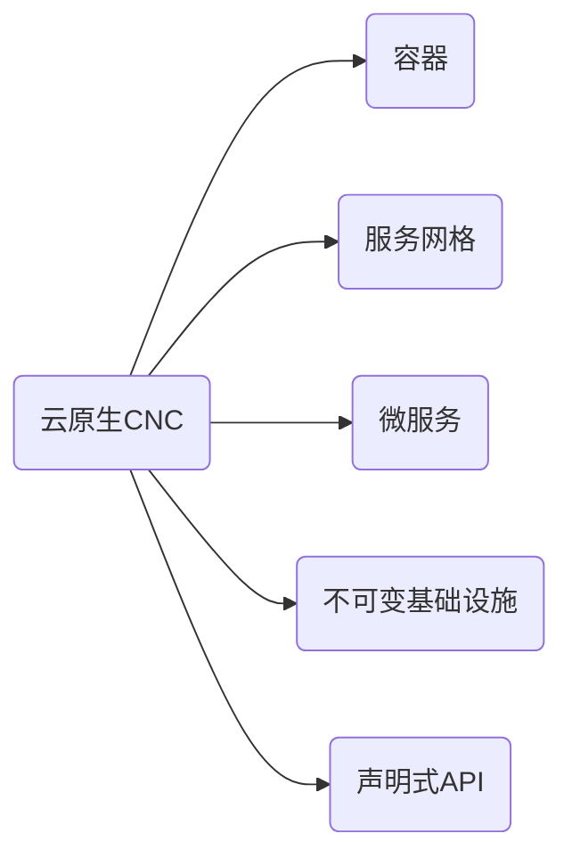

# 资料库

## 目录 
1. [markdown](markdown.md)
1. [git](git.md)
1. [测试](test.md)

## 待办

- [x] github.io 
  - [x] 动态加载markdown文件，默认加载README.md 
  - [x] [jsdelivr](https://www.jsdelivr.com/)
  - [x] [marked](https://marked.js.org/)(commonmark不支持复选框)
  - [x] [MathJax](https://github.com/mathjax/MathJax)，写在行内代码或代码块内避免markdown解析冲突
  - [x] [mermaid](https://github.com/mermaid-js/mermaid)
  - [x] [flowchart.js](https://github.com/adrai/flowchart.js)
  - [x] [js-sequence-diagrams](https://github.com/bramp/js-sequence-diagrams)
- [x] markdown
- [ ] docker
- [ ] git
  - [ ] git 基础
  - [ ] git 分支
  - [ ] git flow

## 知识结构

1. <https://github.com/cncf/toc/blob/main/DEFINITION.md>
2. <https://raw.githubusercontent.com/cncf/trailmap/master/CNCF_TrailMap_latest.png>
