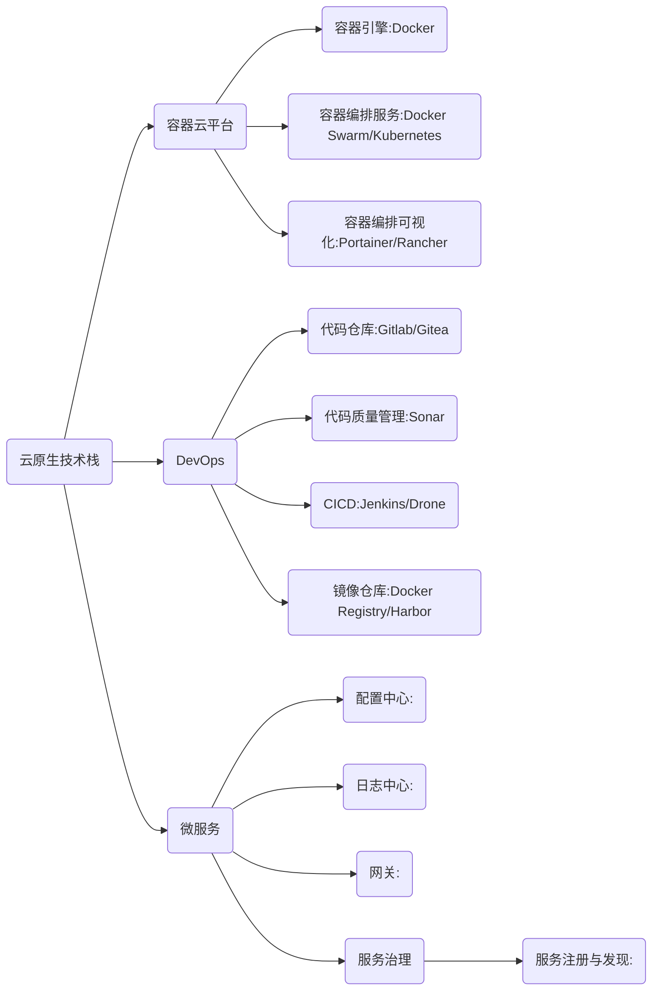
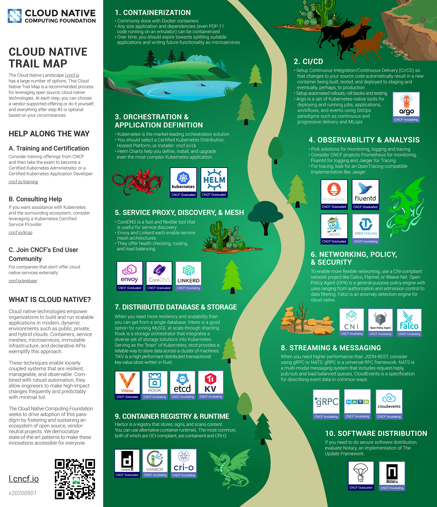

# 云原生计算基金会

## 资料
1. <https://cncf.io/>
2. <https://raw.githubusercontent.com/cncf/trailmap/master/CNCF_TrailMap_latest.png>
3. <https://landscape.cncf.io/>
4. <https://radar.cncf.io/>

## 思维导图

## 路线图

