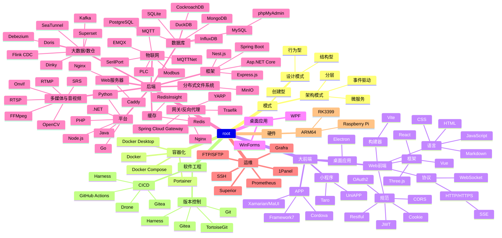

---
# https://vitepress.dev/reference/default-theme-home-page
layout: home

hero:
  # image:
  #   src: /logo.svg
  #   alt: Nbaxp
  # name: 'Nbaxp'
  # text: '知识索引、核心知识点、总结'
  # tagline: 模式、容器化、大前端、桌面应用、后端、运维、硬件、软件工程
#   actions:
#     - theme: brand
#       text: Markdown Examples
#       link: /markdown-examples
#     - theme: alt
#       text: API Examples
#       link: /api-examples

# features:
#   - title: 前端
#     icon:
#       src: /icons/html.svg
#       alt: html
#     details: Lorem ipsum dolor sit amet, consectetur adipiscing elit
#   - title: 后端
#     details: Lorem ipsum dolor sit amet, consectetur adipiscing elit
#   - title: 架构
#     details: Lorem ipsum dolor sit amet, consectetur adipiscing elit
#   - title: 项目管理
#     details: Lorem ipsum dolor sit amet, consectetur adipiscing elit
---

<!-- # 知识图谱 -->

