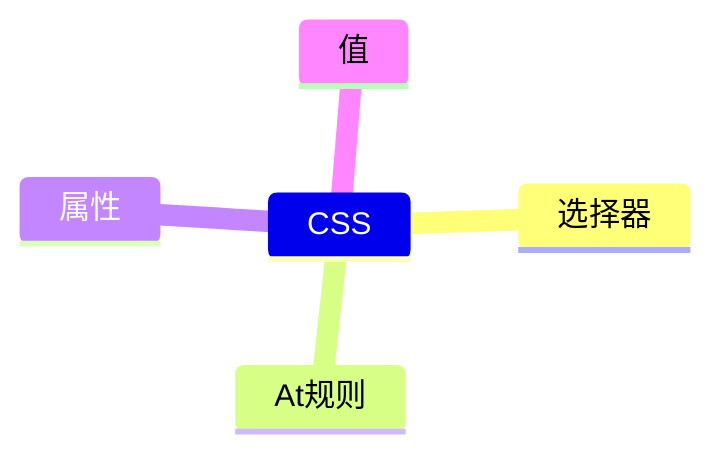

# CSS

[CSS 全部规范](https://www.w3.org/Style/CSS/specs.en.html)



## [选择器](https://www.w3.org/TR/selectors-4/#overview)

```bash
mindmap
选择器
  1
    *
    E
  2
    E:not(s1, s2, …)
    E:is(s1, s2, …)
    E:where(s1, s2, …)
    E:has(rs1, rs2, …)
  3
    E.warning
    E#myid
    E[foo]
    E[foo="bar"]
    E[foo="bar" i]
    E[foo="bar" s]
    E[foo~="bar"]
    E[foo^="bar"]
    E[foo$="bar"]
    E[foo*="bar"]
    E[foo|="bar"]
  4
    E:dir(ltr)
    E:lang(zh,"*-hant")
  5
    E:any-link
    E:link
    E:visited
    E:local-link
    E:target
    E:target-within
    E:scope
  6
    E:current
    E:current(s)
    E:past
    E:future
  7
    E:active
    E:hover
    E:focus
    E:focus-within
    E:focus-visible
  8
    E:enabled
    E:disabled
    E:read-write
    E:read-only
    E:placeholder-shown
    E:default
    E:checked
    E:indeterminate
    E:valid
    E:invalid
    E:in-range
    E:out-of-range
    E:required
    E:optional
    E:blank
    E:user-invalid
  9
    E:root
    E:empty
    E:nth-child(("E:nth-child(n [of S]?"))
    E:nth-last-child(("E:nth-last-child(n [of S]?"))
    E:first-child
    E:last-child
    E:only-child
    E:nth-of-type(("E:nth-of-type(n"))
    E:nth-last-of-type(("E:nth-last-of-type(n"))
    E:first-of-type
    E:last-of-type
    E:only-of-type
  10
    E F
    E > F
    E + F
    E ~ F
  11
    F || E
    E:nth-col(("E:nth-col(n)"))
    E:nth-last-col(("E:nth-last-col(n)"))
```
