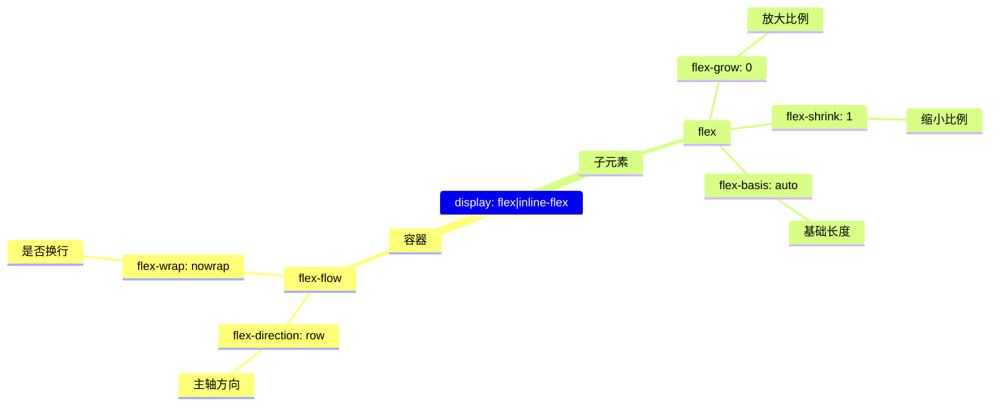

# Flex 弹性布局

Flexible Box 模型，通常被称为 flexbox，是一种一维的布局模型。默认主轴从左到右，交叉轴从上到下。

```mermaid
mindmap
display: flex|inline-flex
  容器
    flex-flow
      flex-direction: row
        主轴方向
      flex-wrap: nowrap
        是否换行
  子元素
    flex
      flex-grow: 0
        放大比例
      flex-shrink: 1
        缩小比例
      flex-basis: auto
        基础长度
```
