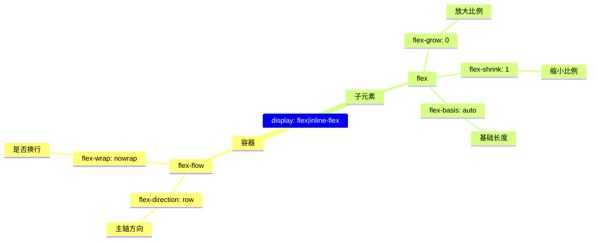

# Web 前端布局

## FlexBox CSS 属性分类



## Tailwind CSS 布局相关工具类

```css
.flex {
  display: flex; /*应用在容器元素，启用 Flexbox 布局*/
}
.flex-col {
  flex-direction: column; /*应用在容器元素，设置主轴方向为垂直*/
}
.flex-1 {
  flex: 1; /*应用在子元素，设置自动填充*/
}
.shink-0 {
  flex-shrink: 0; /*应用在子元素，设置禁止缩小*/
}
.overflow-hidden {
  overflow: hidden; /*应用在容器元素，设置溢出隐藏*/
}
.overflow-auto {
  overflow: auto; /*应用在容器元素，设置溢出自动*/
}
```

## 左右布局

- 默认为左右布局
- 父元素添加`overflow-hidden`防止溢出
- 子元素添加`overflow-auto`设置溢出自动滚动
- 子元素添加`flex-1`或`shink-0`设置自动填充或禁止缩小

:::demo

```vue
<template>
  <div class="box flex overflow-hidden">
    <div class="item shink-0">禁止缩放</div>
    <div class="item flex-1 overflow-auto">
      <div style="width:100vw;height:100vh">自动填充</div>
    </div>
    <div class="item shink-0">禁止缩放</div>
  </div>
</template>
<style scoped>
section {
  width: 100%;
  height: 200px;
}
.box {
  width: 100%;
  height: 200px;
  gap: 0.5rem;
  .item {
    padding: 1rem;
    background: lightblue;
  }
}
</style>
```

:::

## 上下布局

添加`flex-col`设置垂直布局

:::demo

```vue
<template>
  <div class="box flex flex-col overflow-hidden">
    <div class="item shink-0">禁止缩放</div>
    <div class="item flex-1 overflow-auto">
      <div style="width:100vw;height:100vh">自动填充</div>
    </div>
    <div class="item shink-0">禁止缩放</div>
  </div>
</template>
<style scoped>
section {
  width: 100%;
  height: 200px;
}
.box {
  width: 100%;
  height: 200px;
  gap: 1rem;
  .item {
    padding: 1rem;
    background: lightblue;
  }
}
</style>
```

:::

## 常见布局

:::demo

```vue
<template>
  <div class="box flex flex-col overflow-hidden">
    <div class="item shink-0">Header</div>
    <div class="item flex-1 flex">
      <div class="itemshink-0">Aside</div>
      <div class="item flex-1 flex flex-col">
        <div class="item flex-1">Main</div>
        <div class="item shink-0">Footer</div>
      </div>
    </div>
    <div class="item shink-0">Footer</div>
  </div>
</template>
<style scoped>
section {
  width: 100%;
  height: 200px;
}
.box {
  width: 100%;
  height: 200px;
  gap: 1rem;
  .item {
    padding: 1rem;
    background: lightblue;
  }
}
</style>
```

:::

:::demo

```vue
<template>
  <div class="flex"></div>
</template>
```

:::demo

```vue
<template>
  <div class="html-body flex">
    <section class="flex-1 flex flex-col">
      <header>Header</header>
      <main class="flex-1">Main</main>
      <footer>Footer</footer>
    </section>
  </div>

  <div class="html-body flex">
    <section class="flex-1 flex flex-col">
      <header>Header</header>
      <section class="flex flex-1">
        <aside>Aside</aside>
        <main class="flex-1">Main</main>
      </section>
      <footer>Footer</footer>
    </section>
  </div>

  <div class="html-body flex">
    <section class="flex-1 flex">
      <aside>Aside</aside>
      <section class="flex flex-1 flex-col">
        <header>Header</header>
        <main class="flex flex-1">Main</main>
        <footer>Footer</footer>
      </section>
    </section>
  </div>

  <div class="html-body flex">
    <section class="flex-1 flex flex-col">
      <header>Header</header>
      <section class="flex flex-1">
        <aside>Aside</aside>
        <section class="flex flex-1 flex-col">
          <main class="flex-1">Main</main>
          <footer>Footer</footer>
        </section>
      </section>
    </section>
  </div>

  <div class="html-body flex">
    <section class="flex-1 flex flex-col">
      <header class="flex">Header</header>
      <section class="flex flex-1 overflow-y-auto">
        <aside class="flex flex-col">
          <div>Avatar</div>
          <div class="flex-1 overflow-y-auto scrollbar">
            <nav>Nav</nav>
          </div>
          <div>Version</div>
        </aside>
        <section class="flex flex-1 flex-col">
          <div class="tabs">Tabs</div>
          <section class="flex-1 flex flex-col overflow-y-auto scrollbar">
            <div class="breadcrumb">Breadcrumb</div>
            <section class="flex-1 flex flex-col ">
              <main class="flex-1">Main</main>
              <footer>Footer</footer>
            </section>
          </section>
        </section>
      </section>
    </section>
  </div>
</template>
```

:::

## 添加滚动处理

:::demo

```vue
<template>
  <div class="html-body flex">
    <section class="flex-1 flex flex-col">
      <header class="flex">Header</header>
      <section class="flex flex-1 overflow-y-auto">
        <aside class="flex flex-col">
          <div>Avatar</div>
          <div class="flex1 overflow-y-auto scrollbar">
            <nav style="height: 150vh">Nav</nav>
          </div>
          <div>Version</div>
        </aside>
        <section class="flex flex-1 flex-col">
          <div class="tabs">Tabs</div>
          <section class="flex-1 flex flex-col overflow-y-auto scrollbar">
            <div class="breadcrumb">Breadcrumb</div>
            <section class="flex-1 flex flex-col ">
              <main id="top" class="flex flex-1">
                <div style="height: 200vh">Main</div>
              </main>
              <footer class="flex">Footer</footer>
            </section>
          </section>
        </section>
      </section>
    </section>
  </div>
</template>
<style scoped>
@supports selector(::-webkit-scrollbar) {
  ::-webkit-scrollbar {
    width: 8px;
    height: 8px;
    background: transparent;
  }
  ::-webkit-scrollbar-corner {
    background: transparent;
  }
  ::-webkit-scrollbar-thumb {
    border-radius: 6px;
    border: 2px solid transparent;
    background-clip: content-box;
    background-color: green;
  }
}

@supports not selector(::-webkit-scrollbar) {
  * {
    scrollbar-width: thin;
    scrollbar-color: green transparent;
  }
}
</style>
```

:::

## 媒体查询

:::demo

```vue
<template>
  <div class="container">.container</div>
</template>
<style scoped>
:root {
  --breakpoint-sm: 640px;
  --breakpoint-md: 768px;
  --breakpoint-lg: 1024px;
  --breakpoint-xl: 1280px;
  --breakpoint-2xl: 1536px;
  --max-width: 100%;
  --color-bg: #fff;
  --color-text: #000;
}
.container {
  width: 100%;
  max-width: var(--max-width);
  background-color: var(--color-bg);
  color: var(--color-text);
}

@media (min-width: var(--breakpoint-sm)) {
  :root {
    --max-width: var(--breakpoint-sm);
  }
}

@media (min-width: var(--breakpoint-md)) {
  :root {
    --max-width: var(--breakpoint-md);
  }
}

@media (min-width: var(--breakpoint-lg)) {
  :root {
    --max-width: var(--breakpoint-lg);
  }
}

@media (min-width: var(--breakpoint-xl)) {
  :root {
    --max-width: var(--breakpoint-xl);
  }
}

@media (min-width: var(--breakpoint-2xl)) {
  :root {
    --max-width: var(--breakpoint-2xl);
  }
}
@media (prefers-color-scheme: dark) {
  :root {
    --color-bg: #000;
    --color-text: #fff;
  }
}
</style>
```

:::
