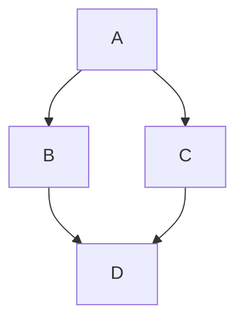

# 测试

## 微服务架构

### 单体应用改造：

1. 有状态服务改为无状态服务：使用 jwt bearer 认证
1. 本地配置文件改为配置中心：使用 nacos 等
1. 本地日志改为日志中心：使用 elk 等

### 服务间调用改造

1. 从配置中读取服务中心地址
1. 从服务中心读取API地址列表并实时接收API列表的更新

### 前后端分离改造

1. 前端单独部署
1. 通过网关统一访问后端API


## 待办测试

- [x] 功能列表
  - [x] 已完成
  - [x] 未完成
  - [x] cdn：[jsdelivr](https://www.jsdelivr.com/)

## mermaid 流程图



## 数学公式

inline:`$ {e}^{i\pi } 1=0 $`

block:

```
$$
\int_{0}^{1}f(x)dx \sum_{1}^{2}\int_{0}^{1}f(x)dx \sum_{1}^{2}\int_{0}^{1}f(x)dx \sum_{1}^{2}\int_{0}^{1}f(x)dx \sum_{1}^{2}\int_{0}^{1}f(x)dx \sum_{1}^{2}\int_{0}^{1}f(x)dx \sum_{1}^{2}\int_{0}^{1}f(x)dx \sum_{1}^{2}\int_{0}^{1}f(x)dx \sum_{1}^{2}\int_{0}^{1}f(x)dx \sum_{1}^{2}\int_{0}^{1}f(x)dx \sum_{1}^{2}
$$
```

inine:$ {e}^{i\pi } 1=0 $

block:$$\int_{0}^{1}f(x)dx \sum_{1}^{2}\int_{0}^{1}f(x)dx \sum_{1}^{2}\int_{0}^{1}f(x)dx \sum_{1}^{2}\int_{0}^{1}f(x)dx \sum_{1}^{2}\int_{0}^{1}f(x)dx \sum_{1}^{2}\int_{0}^{1}f(x)dx \sum_{1}^{2}\int_{0}^{1}f(x)dx \sum_{1}^{2}\int_{0}^{1}f(x)dx \sum_{1}^{2}\int_{0}^{1}f(x)dx \sum_{1}^{2}\int_{0}^{1}f(x)dx \sum_{1}^{2}$$

## flowchart.js

```flow
st=>start: Start
op=>operation: Your Operation
cond=>condition: Yes or No?
e=>end
st->op->cond
cond(yes)->e
cond(no)->op
```

## js-sequence-diagrams 

```sequence
Andrew->China: Says Hello
Note right of China: China thinks\nabout it
China-->Andrew: How are you?
Andrew->>China: I am good thanks!
```